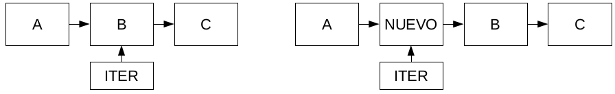

# FAQ - Lista Enlazada
{:.no_toc}

* Contenido
{:toc}

## ¿Cuándo se define que el iterador externo está al final?

Una pregunta usual a la hora de implementar el iterador externo, es cuál debe ser la condición para definir si el iterador se encuentra al final:
- Cuando el `actual` es igual a `NULL`.
- Cuando el `actual` es igual al `último` de la lista.

La idea del iterador externo es que nos permita pasar por todos los elementos de la lista de forma cómoda. Una forma usual de utilizarlo es dentro de un ciclo, ya sea `while`, o `for`:
```cpp
  lista_iter_t* iter = lista_iter_crear(lista);
  while (!lista_iter_al_final(iter)) {
      void* dato = lista_iter_ver_actual(iter):
      // Realizamos alguna operación sobre el dato
      lista_iter_avanzar(iter);
  }
  lista_iter_destruir(iter);
```

```cpp
  lista_iter_t* iter;
  for (iter = lista_iter_crear(lista); !lista_iter_al_final(iter); lista_iter_avanzar(iter)) {
      void* dato = lista_iter_ver_actual(iter):
      // Realizamos alguna operación sobre el dato
  }
  lista_iter_destruir(iter);
```

En cualquiera de los dos casos, que son equivalentes, es importante notar que el ciclo debe poder pasar por todos los elementos de la lista.

Analizando las dos opciones que tenemos, podemos ver que la segunda va a dar por terminado el ciclo sin haber entrado para el último elemento (una forma fácil de corroborarlo, es revisar el caso de una lista con un sólo elemento y hacer el seguimiento). Por ésto, la solución correcta es la primera: el iterador se encontrará al final cuando ya haya pasado por todos los elementos, lo cual quiere decir que el puntero `actual` es `NULL`.

## ¿Cómo se comporta el agregado y la eliminación en una lista enlazada con iteradores?

La inserción en una lista enlazada sigue dos reglas:
  - El elemento insertado va a tomar la posicion del elemento al que se apunta.
  - Luego de una insercion, el iterador va a apuntar al nuevo elemento.

Esto no quiere decir que `lista_insertar` sobreescriba datos; sino que si el actual del iterador es el segundo elemento de la lista, realizar una inserción colocaría un nuevo dato entre el elemento uno y el dos:



Dos implicaciones que surgen son:
  - Si se inserta un elemento con un iterador apuntando al primer elemento de la lista, la operación es idéntica a llamar a `lista_insertar_primero`.
  - Si se inserta un elemento con un iterador apuntando al final, la operación es idéntica a llamar a `lista_insertar_ultimo`.

La eliminación funciona de manera análoga: se elimina el elemento al que está apuntando el iterador y este apunta al elemento siguiente:


Considerando esto resulta:
  - La eliminación de un elemento con un iterador apuntando al primer elemento de la lista es idéntica a `lista_borrar_primero`.
  - La eliminacion de un elemento con un iterador apuntando al último elemento de la lista (esto es: al elemento tal que cuando se avanza el iterador está al final) se comportaría como una primitiva `lista_borrar_ultimo`. Eliminar este elemento haría que el iterador apunte al final de la lista.

## ¿Cómo se comporta el iterador interno?

El iterador interno es una herramienta para poder procesar los elementos de la lista sin necesidad de manejar la memoria del iterador externo.
Para hacer esto es necesario escribir la función visitar en donde se especifique qué es lo que se va a hacer con estos nodos:

``` cpp
bool visitar(void* dato, void* extra);
```

Esta función va a ser llamada inicialmente con el dato que ocupa la primera posición de la lista. Como esta función va a ser llamada de manera automática por la primitiva lista_iterar, además debe recibir un puntero extra que puede ser usado para mantener una memoria entre las las sucesivas llamadas.
Adicionalmente, esta función devuelve un valor booleano. Si en algún momento se devuelve false, la iteración se interrumpiría automáticamente.

## ¿Puedo insertar con el iterador externo y con las primitivas de la lista a la vez?

Si bien poder se puede, esto no es algo que se deba hacer. Al crear un iterador externo de cualquier estructura, comienza un pacto entre el programador y el usuario, y este implica que si creé un iterador externo, es para usarlo. Intentar usar ambas formas de insertar/eliminar 'a la vez' (mientras 'viva' un iterador externo), es romper este pacto y puede generar comportamiento no esperado del lado de la estructura que estoy usando.
