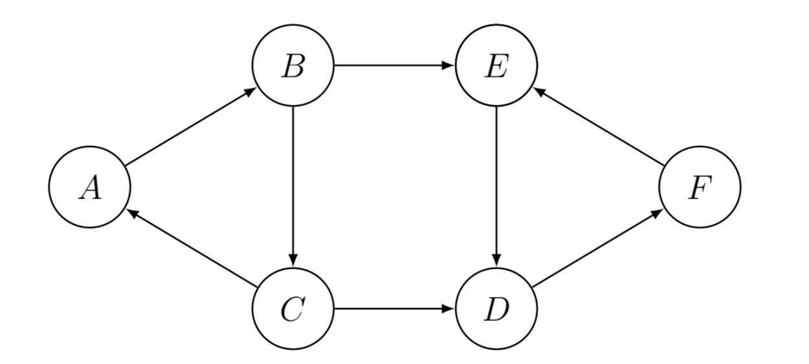
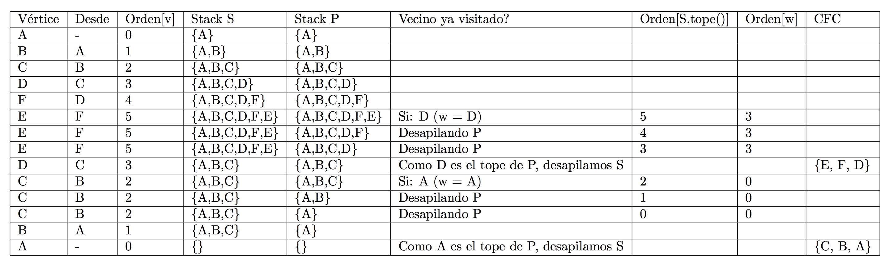

# Componentes Fuertemente Conexas (CFC)

Una [componente fuertemente conexa](https://en.wikipedia.org/wiki/Strongly_connected_component)
de un **grafo dirigido** es un conjunto de vértices dentro del grafo donde todos esos vértices se conectan todos
entre sí (existe un camino de cualquiera de esos vértices, a cualquier otro).
Un grafo dirigido puede tener ninguna, una o más _CFC_'s. Vale aclarar que nos interesan obtener las CFC más grandes
(dentro de cualquier CFC, cualquier subconjunto de ésta va a ser una CFC en sí).

## Algoritmo de Tarjan

Para resolver este problema, vamos a utilizar el [Algoritmo de Tarjan](https://en.wikipedia.org/wiki/Tarjan%27s_strongly_connected_components_algorithm). Existe alternativamente el
[Algoritmo de Kosaraju](https://en.wikipedia.org/wiki/Kosaraju%27s_algorithm), que no analizaremos en este apunte.

La idea del algoritmo de Tarjan es realizar un recorrido en profundidad (DFS), contando con dos pilas, _S_ y _P_,
y el orden del recorrido en profundidad, respecto de la exploración en profundidad. Para cada vértice no visitado ponemos su orden en 0 y:
1. Marcamos a _v_ como visitado, con su orden.
1. Apilar al vértice en _S_ y _P_.
1. Para cada vértice _w_ adyacente a _v_:
	* Si no fue visitado, visitarlo (recursivamente).
	* Si ya fue visitado, si no está ya en una CFC: desapilar de _P_ hasta que el tope tenga un orden menor o igual al
	de _w_.
1. Si _v_ es tope de _P_:
	a. Desapilar de _S_ hasta llegar a tener de tope a _v_, y agregar todos los vértices a una CFC.
	a. Desapilar _v_ de _P_.

```python
def dfs_cfc(grafo, v, visitados, orden, p, s, cfcs, en_cfs):
	visitados.agregar(v)
	s.apilar(v)
	p.apilar(v)
	for w in grafo.adyacentes(v):
		if w not in visitados:
			orden[w] = orden[v] + 1
			dfs_cfc(grafo, w, visitados, orden, p, s, cfcs, en_cfcs)
		elif w not in en_cfs:
			while orden[p.ver_tope()] > orden[w]:
				p.desapilar()

	if p.ver_tope() == v:
		p.desapilar()
		z = None
		nueva_cfc = []
		while z != v:
			z = s.desapilar()
			en_cfs.agregar(z)
			nueva_cfc.append(z)
		cfcs.append(nueva_cfc)

def cfc(grafo):
	visitados = set()
	orden = {}
	p = Pila()
	s = Pila()
	cfcs = []
	en_cfs = set()
	for v in grafo:
		if v not in visitados:
			orden[v] = 0
			dfs_cfc(grafo, v, visitados, orden, p, s, cfcs, en_cfs)
	return cfcs
```

Siendo que es tan solo una aplicación de un algoritmo DFS, que utiliza pilas (las operaciones son de tiempo constante), y
cada vértice aparece una vez en cada pila únicamente, el orden será $$\mathcal{O}(V + E)$$.
Realizamos el seguimiento, paso a paso, sobre el siguiente grafo:

{:width="80%"}
{:width="100%"}

## Bibliografía y referencias

- Weiss, Mark Allen: "Data Structures and Algorithms" (tercera edición), Pearson, 1999. Cap. 9.6.5: _Finding Strong Components_.
- Cormen, Thomas; Leiserson, Charles; Rivest, Ronald; Stein, Clifford: "Introduction to Algorithms" (tercera edición), MIT Press, 2009. Cap. 22.5: _Strongly Connected Components_.


