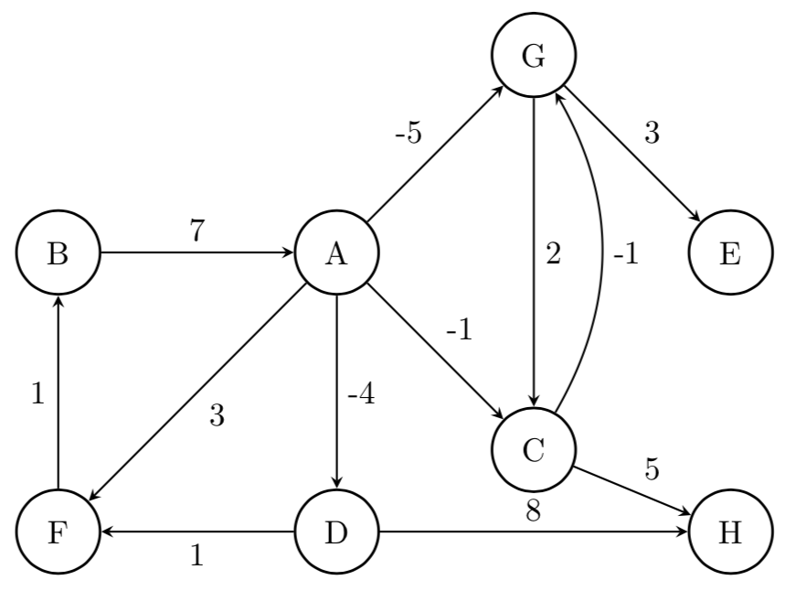
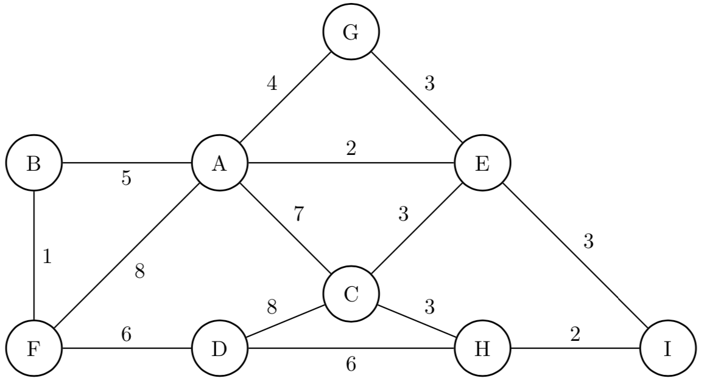
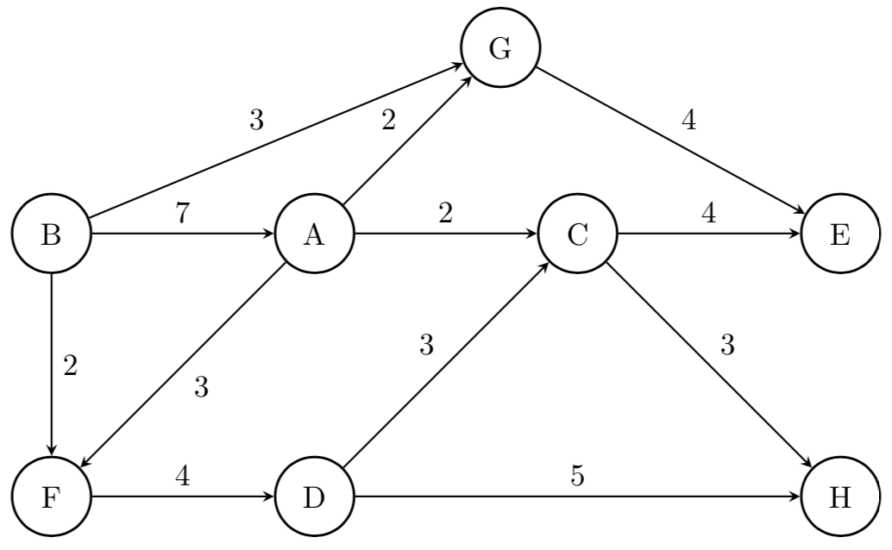

# Grafos: Aplicaciones y Algoritmos
{:.no_toc}

## Contenidos
{:.no_toc}

1. TOC
{:toc}

## Ejercicio resuelto

El diámetro de una red es el máximo de las distancias mínimas entre todos los vértices
de la misma. Implementar un algoritmo que permita obtener el diámetro de una red, para
el caso de un grafo no dirigido y no pesado. Indicar el orden del algoritmo propuesto.

### Solución

Vamos desglosando lo que nos dice el enunciado para entender cómo resolverlo: El diámetro de una red (grafo, etc.)
es la distancia más grande entre todos los caminos mínimos que hayan. Por lo tanto, será necesario obtener todas las
distancias mínimas y quedarnos con el máximo valor. En esta definición no contamos el infinito, puesto que no tiene
mayor sentido. Particularmente vamos a asumir que el grafo es conexo, si bien puede resolverse también para otros casos
(incluyendo que sea dirigido). Sería tan solo despreciar el caso en el que no se haya encontrado camino (ej, que
camino mínimo devuelva `None`).

Una primera solución podría ser:

```python
def diametro(grafo):
    max_min_dist = 0
    for v in grafo:
        for w in grafo:
            distancia = camino_minimo(grafo, v, w)
            # aca podria validar si la distancia no es None o infinito
            if distancia > max_min_dist:
                max_min_dist = distancia
    return max_min_dist
```

El problema aquí es que el costo de todo esto va a ser $$\mathcal{O}(V^2 (V + E))$$ (considerando que la forma eficiente
de obtener los caminos mínimos en un grafo no pesado es utilizando un recorrido BFS), ya que buscamos cada camino mínimo
para cada origen y destino posible.

Una optimización (bastante evidente) es aprovechar que BFS nos puede devolver un diccionario con todos los caminos mínimos
(en particular, sólo nos interesan las distancias, no las forma de reconstruirlos), y luego solo quedarnos con la distancia
más grande:

```python
def diametro(grafo):
    max_min_dist = 0
    for v in grafo:
        distancias = caminos_minimos(grafo, v)
        for w in distancias:
            if distancias[w] > max_min_dist:
                max_min_dist = distancias[w]
    return max_min_dist
```

Con esto, la solución pasará a ser $$\mathcal{O}(V (V + E))$$. Ya que estamos, también escribimos cómo sería una
implementación para obtener esos caminos mínimos:

```python
def caminos_minimos(grafo, origen)
    q = Cola()
    visitados = set()
    distancia = {}
    distancia[origen] = 0
    visitados.add(origen)
    q.encolar(origen)

    while not q.esta_vacia():
        v = q.desencolar()
        for w in grafo.adyacentes(v):
            if w not in visitados:
                distancia[w] = distancia[v] + 1
                q.encolar(w)
                visitados.add(w)
    return distancia
```


## Ejercicios propuestos


1.  (★★) a. Obtener una representación del camino mínimo desde el vértice A en el siguiente grafo
        (representado con una matriz de adyacencias), hacia todos los demás vértices,
        utilizando el algoritmo de Dijkstra:

        |   | A | B | C | D | E | F |
        |---|---|---|---|---|---|---|
        | A | 0 | 7 | 5 | 0 | 3 | 8 |
        | B | 7 | 0 | 0 | 0 | 1 | 3 |
        | C | 5 | 0 | 0 | 5 | 3 | 2 |
        | D | 0 | 0 | 5 | 0 | 2 | 0 |
        | E | 3 | 1 | 3 | 2 | 0 | 0 |
        | F | 8 | 3 | 2 | 0 | 0 | 0 |

    b. ¿Qué condiciones debe cumplir el grafo para poder aplicar el algoritmo de Dijkstra?
       ¿Qué característica tiene el grafo si al finalizar la ejecución del algoritmo, uno o
       más vértices quedan a *distancia infinita*?

1.  (★★★) a. Obtener una representación del camino mínimo desde el vértice A en el siguiente grafo
    (representado con una matriz de adyacencias), hacia todos los demás vértices,
    utilizando el algoritmo de Bellman-Ford.

    

    b. Volver a realizar, suponiendo que la arista de `B` a `A` ahora tiene un peso de 1.

1.  (★★) Obtener el Árbol de Tendido Mínimo del siguiente grafo:

    a. Utilizando el Algoritmo de Kruskal.

    b. Utilizando el Algoritmo de Prim.

    


1.  (★★★) Dadas las matrices de adyacencia `M1`, `M2` y `M3`, responder las siguientes preguntas
    (recomendamos pasar los grafos a una representación visual para mayor facilidad):

    a. ¿Puede ser el grafo definido por `M2` un árbol de tendido mínimo de `M1`? Justificar.

    b. Realizar un seguimiento de aplicar el algoritmo de Kruskal para obtener un árbol de tendido
    mínimo del grafo definido por `M3`.

    ```
    | M1 | A | B | C | D | E | F | G |
    |----|---|---|---|---|---|---|---|
    | A  | 0 | 3 | 4 | 0 | 0 | 0 | 0 |
    | B  | 3 | 0 | 5 | 3 | 3 | 0 | 0 |
    | C  | 4 | 5 | 0 | 2 | 0 | 0 | 6 |
    | D  | 0 | 3 | 2 | 0 | 4 | 2 | 1 |
    | E  | 0 | 3 | 0 | 4 | 0 | 6 | 0 |
    | F  | 0 | 0 | 0 | 2 | 6 | 0 | 0 |
    | G  | 0 | 0 | 6 | 1 | 0 | 0 | 0 |

    | M2 | A | B | C | D | E | F | G |
    |----|---|---|---|---|---|---|---|
    | A  | 0 | 3 | 4 | 0 | 0 | 0 | 0 |
    | B  | 3 | 0 | 0 | 0 | 3 | 0 | 0 |
    | C  | 4 | 0 | 0 | 2 | 0 | 0 | 6 |
    | D  | 0 | 0 | 2 | 0 | 0 | 2 | 0 |
    | E  | 0 | 3 | 0 | 0 | 0 | 0 | 0 |
    | F  | 0 | 0 | 0 | 2 | 0 | 0 | 0 |
    | G  | 0 | 0 | 6 | 0 | 0 | 0 | 0 |

    | M3 | A | B | C | D  | E  | F  | G  |
    |----|---|---|---|----|----|----|----|
    | A  | 0 | 6 | 0 | 4  | 0  | 0  | 0  |
    | B  | 6 | 0 | 7 | 8  | 6  | 0  | 0  |
    | C  | 0 | 7 | 0 | 0  | 4  | 0  | 0  |
    | D  | 4 | 8 | 0 | 0  | 14 | 5  | 0  |
    | E  | 0 | 6 | 4 | 14 | 0  | 7  | 8  |
    | F  | 0 | 0 | 0 | 5  | 7  | 0  | 10 |
    | G  | 0 | 0 | 0 | 0  | 8  | 10 | 0  |
    ```

1.  (★★) Analizar la complejidad del algoritmo de Prim según si el grafo está implementado con
    listas de adyacencia o matriz de adyacencia.

1.  (★★) Responder las siguientes preguntas, **justificando** la respuesta:

    a. Al aplicar sobre un grafo el algoritmo de Dijkstra para encontrar caminos mínimos desde un vértice $$v$$
    cualquiera, se obtiene un árbol definido por el diccionario de padres (que permite reconstruir dichos
    caminos mínimos). Dicho árbol, ¿es siempre de tendido mínimo?

    b. Al obtener un árbol de tendido mínimo de un grafo, se asegura que la suma de los pesos de las aristas
    sean mínimos.
    ¿Es posible utilizar el árbol de tendido mínimo para encontrar el camíno mínimo entre dos pares de
    vértices cualesquiera?

    c. Si un grafo es no pesado, ¿Se puede utilizar el Algoritmo de Dijkstra para obtener los caminos mínimos
    en dicho grafo?

1.  (★★★) Realizar un seguimiento de aplicar el Algoritmo de Ford-Fulkerson para obtener el Flujo máximo a
    través de la red definida por el siguiente grafo.

    

1.  (★★★) Implementar por **backtracking** un algoritmo que, dado un grafo no dirigido y un número
    $$n \lt \left|\mathcal{V} \right|$$, nos permita obtener un subconjunto de $$n$$ vértices tal que ningún par de dichos
    vértices sean adyacentes entre sí. Se puede suponer que los vértices están identificados con números de
    0 a $$\left| \mathcal{V} \right|-1$$.

1.  (★★★) Implementar un algoritmo que reciba un grafo y un número $$n$$ que, utilizando **backtracking**,
    indique si es posible pintar cada vértice con $$n$$ colores de tal forma que no hayan dos vértices adyacentes
    con el mismo color.

1.  (★★★★) Problema del viajante (TSP): Dada una lista de ciudades y la distancia entre cada par de ellas, ¿Cuál
    es la ruta más corta posible que visita cada ciudad exactamente una vez y al finalizar regresa a la ciudad de
    origen?

1.  (★★★) Implementar un algoritmo que reciba un grafo, un vértice $$v$$ y otro $$w$$ y, utilizando **backtracking**,
    obtenga **todos** los caminos simples de $$v$$ a $$w$$ en el grafo.

1.  (★★★★) Se cuenta con un grafo en el que sus aristas tiene peso 1 o 2, únicamente. Implementar un algoritmo
    que permita obtener el camino mínimo de un vértice hacia todos los demás, en tiempo $$\mathcal{O}(V + E)$$.

1.  (★★★★★) Implementar un algoritmo que, dado un grafo dirigido, un vértice $$s$$ y otro $$t$$ determine la cantidad
    mínima de aristas que deberían cambiar de sentido en el grafo para que exista un camino de $$s$$ a $$t$$.

1.  (★★★★★) Supongamos que tenemos un sistema de una facultad en el que cada alumno puede pedir hasta 10 libros de
    la biblioteca.
    La biblioteca tiene 3 copias de cada libro. Cada alumno desea pedir libros diferentes. Implementar un algoritmo que
    nos permita obtener la forma de asignar libros a alumnos de tal forma que la cantidad de préstamos sea máxima.
